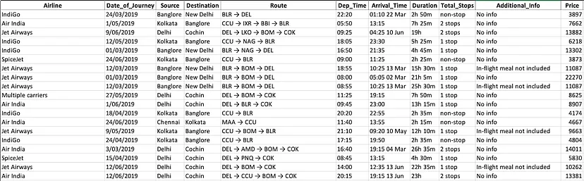

# Flight Fare Prediction

## Objective
This project aims to predict flight fare prices based on several input features, such as airline, source, destination, total stops, and duration and date. The project utilizes machine learning techniques such as preprocessing, transformation and random forest regressor to create a predictive model that can estimate flight fares accurately.

## Dataset
Our flight fare prediction dataset has 10,682 observations with booking details such as: airline, date of journey, source, destination, route, departure time, arrival time, duration, stoppages, additional info (as applicable), and lastly the price, which is our target variable.For more information on the dataset, please visit - https://www.kaggle.com/datasets/nikhilmittal/flight-fare-prediction-mh



## Machine Learning Pipeline
1. Analyze Data: In this initial step, we attempted to comprehend the data and searched for various available features. We looked for things like the shape of the data, the data types of each feature, a statistical summary, etc. at this stage.
2. EDA: EDA stands for Exploratory Data Analysis. It is a process of analyzing and understanding the data. The goal of EDA is to gain insights into the data, identify patterns, and discover relationships and trends. It helps to identify outliers, missing values, and any other issues that may affect the analysis and modeling of the data.
3. Data Cleaning: Data cleaning is the process of identifying and correcting or removing inaccuracies, inconsistencies, and handling missing values in a dataset. We inspected the dataset for duplicate values. The null value and outlier detection and treatment followed. For the imputation of the null value we used the Mean, Median, and Mode techniques, and for the outliers, we used the Clipping method to handle the outliers without any loss to the data.
4. Feature Selection: At this step, we did the encoding of categorical features. We used the correlation coefficient, encoding, feature manipulation, and feature selection techniques to select the most relevant features. SMOTE is used to address the class imbalance in the target variable.
5. Feature Scaling: We scaled the features to bring down all of the values to a similar range. 
6. Model Selection and Implementation: We pass the features to SVM, KNN, Decision Tree, Gradient Boosting, Logistic Regression, AdaBoosting, Naive Bayes & XGBoost classification algorithms. We also did hyperparameter tuning using GridSearchCV.
7. Performance Evaluation: After passing it to various classification models and calculating the metrics like R2 score,Mean Absolute Error, Mean Squared Error and Root Mean Squared Error values. we choose a final model that can make best predictions.


## Artifacts

#### Preprocessings steps

#### Algorithms used to find best model
1. LinearRegression
2. Lasso
3. Ridge        
4. DecisionTreeRegressor  
5. RandomForestRegressor
6. GradientBoostingRegressor 
7. XGBoostRegressor 
8. AdaBoostRegressor
9. BaggingRegressor

## Final Result
The Random Forest Regressor model emerged as the most effective have below metric scores:
* R2 score- 81%

## Deployed URLs


## Project Artifacts

## MLOps

## License
This project is licensed under the Apache-2.0  License.

## Setting up the dev environment
```bash
# Create conda environment 'venv'
conda create -p ./env python=3.9 -y

# Activate the environment
conda activate .\env

# Upgrade pip and install required packages
python -m pip install --upgrade pip
pip install -r requirements.txt

# Install project  as package
python setup.py install